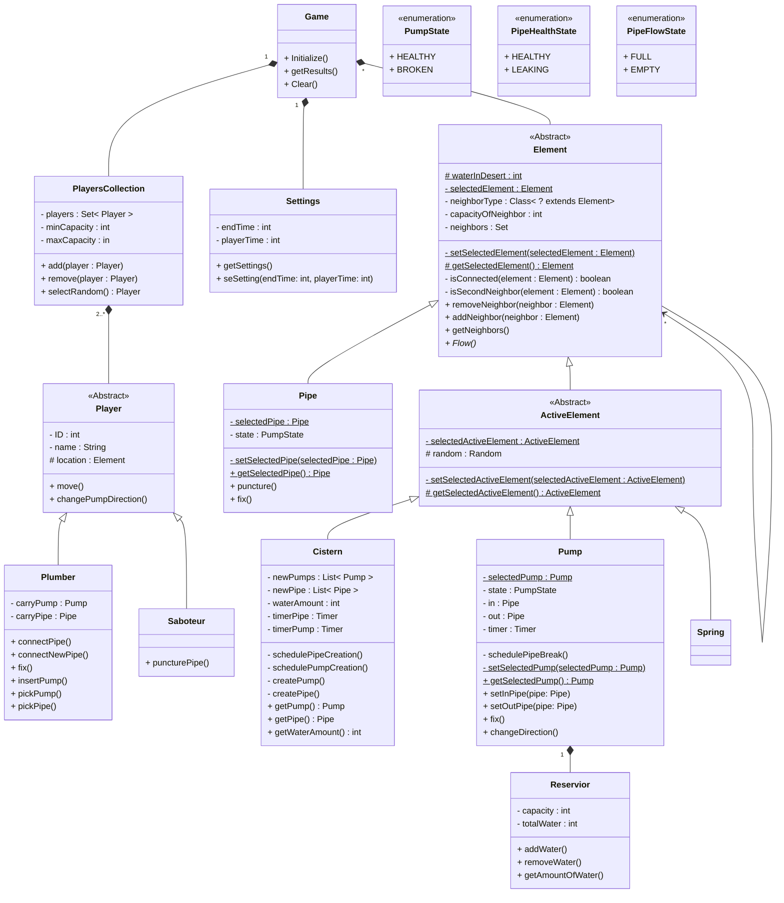

```mermaid
classDiagram

    class Game{

        + Initialize()

        + getResults()

        + Clear()

    }

    Game "1" *-- PlayersCollection

    Game "1" *-- Settings

    Game "*" *-- Element

  
  

    class Settings{

        - endTime : int

        - playerTime : int

        + getSettings()

        + seSetting(endTime: int, playerTime: int)

    }

  
  

    class PlayersCollection{

        - players : Set< Player >

        - minCapacity : int

        - maxCapacity : in

        + add(player : Player)

        + remove(player : Player)

        + selectRandom() Player

    }

    PlayersCollection "2..*" *-- Player

  
  
  

    class Player{

        <<Abstract>>

        - ID : int

        - name : String

        # location : Element

        + move()

        + changePumpDirection()

    }

    Player <|-- Plumber

    Player <|-- Saboteur

    %% Player --> "1" Element

    class Plumber{

        - carryPump : Pump

        - carryPipe : Pipe

        + connectPipe()

        + connectNewPipe()

        + fix()

        + insertPump()

        + pickPump()

        + pickPipe()

    }

    %% Plumber --> Pipe

    %% Plumber --> Pump

    class Saboteur{

        + puncturePipe()

    }

    class Element{

        <<Abstract>>

        # waterInDesert : int$

        - selectedElement : Element$

        - neighborType : Class< ? extends Element>

        - capacityOfNeighbor : int

        - neighbors : Set

        - setSelectedElement(selectedElement : Element)$

        # getSelectedElement() Element$

        - isConnected(element : Element) boolean

        - isSecondNeighbor(element : Element) boolean

        + removeNeighbor(neighbor : Element)

        + addNeighbor(neighbor : Element)

        + getNeighbors()

        + Flow()*

    }

    Element "*" <--Element

    Element<|--Pipe

    class ActiveElement{

        <<Abstract>>

        - selectedActiveElement : ActiveElement$

        # random : Random

        - setSelectedActiveElement(selectedActiveElement : ActiveElement)$

        # getSelectedActiveElement() ActiveElement$

    }

    Element<|--ActiveElement

    class Cistern{

        - newPumps : List< Pump >

        - newPipe : List< Pipe >

        - waterAmount : int

        - timerPipe : Timer

        - timerPump : Timer

        - schedulePipeCreation()

        - schedulePumpCreation()

        - createPump()

        - createPipe()

        + getPump() Pump

        + getPipe() Pipe

        + getWaterAmount() int

    }

    ActiveElement<|--Cistern

    %% Cistern --> "*" Pipe

    %% Cistern --> "*" Pump

    class Pump{

        - selectedPump : Pump$

        - state : PumpState

        - in : Pipe

        - out : Pipe

        - timer : Timer

        - schedulePipeBreak()

        - setSelectedPump(selectedPump : Pump)$

        + getSelectedPump() Pump$

        + setInPipe(pipe: Pipe)

        + setOutPipe(pipe: Pipe)

        + fix()

        + changeDirection()

    }

    ActiveElement<|--Pump

    %% Pump --> "*"Pipe

    class Reservior{

        - capacity : int

        - totalWater : int

        + addWater()

        + removeWater()

        + getAmountOfWater()

    }

    Pump "1" *-- Reservior

  
  

    class Spring

    ActiveElement<|--Spring

  
  

    class Pipe{

        - selectedPipe : Pipe$

        - state : PumpState

        - setSelectedPipe(selectedPipe : Pipe)$

        + getSelectedPipe() Pipe$

        + puncture()

        + fix()

    }

  
  

    class PumpState{

        <<enumeration>>

        + HEALTHY

        + BROKEN

    }

    class PipeHealthState{

        <<enumeration>>

        + HEALTHY

        + LEAKING

    }

    class PipeFlowState{

        <<enumeration>>

        + FULL

        + EMPTY

    }
```

