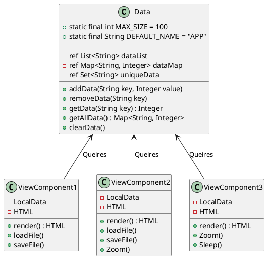
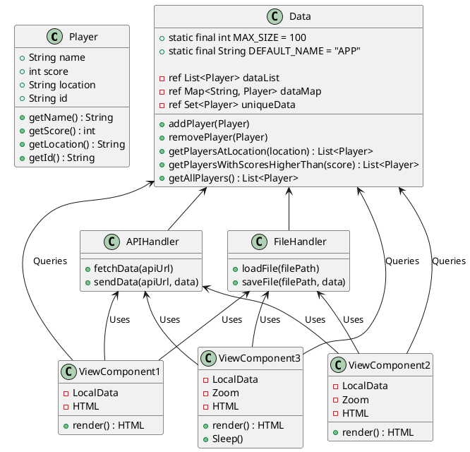
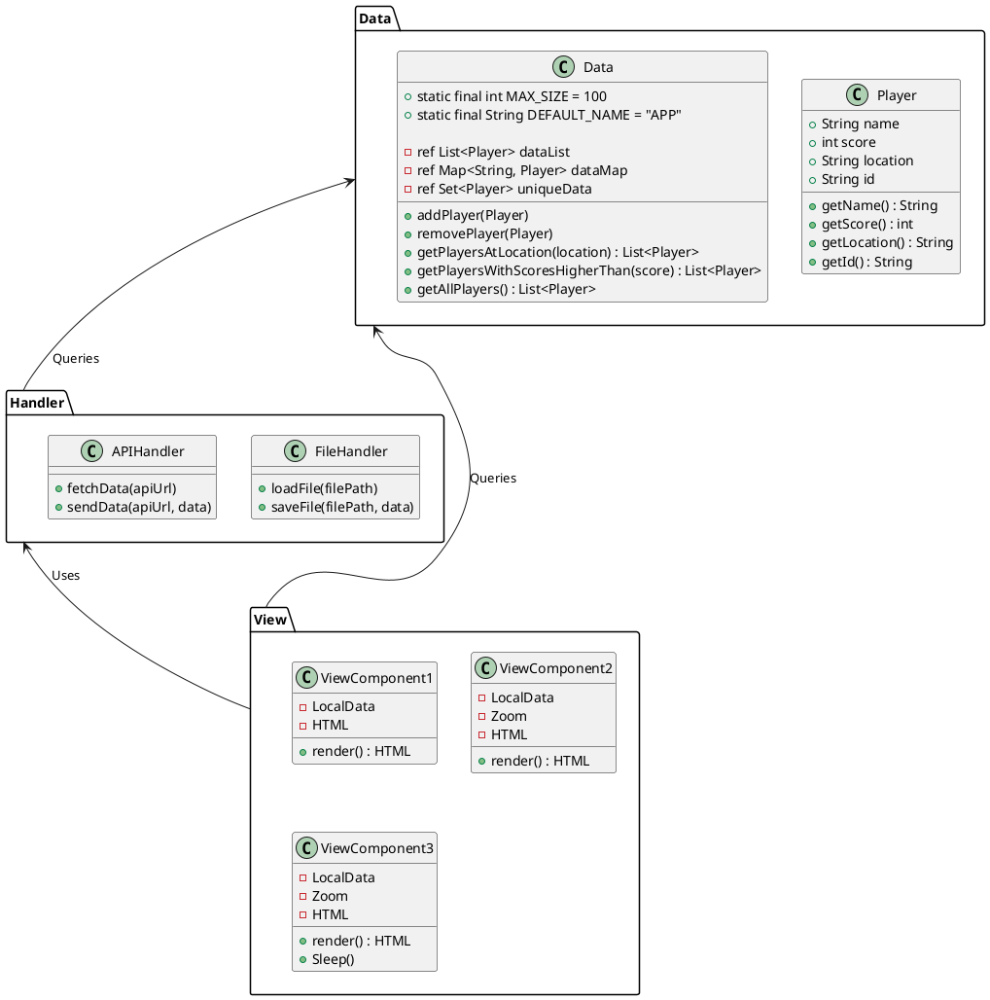

## Data and the Views

```plantuml
@startuml
class Data {
    + static final int MAX_SIZE = 100
    + static final String DEFAULT_NAME = "APP"

    - ref List<String> dataList
    - ref Map<String, Integer> dataMap
    - ref Set<String> uniqueData

    + addData(String key, Integer value)
    + removeData(String key)
    + getData(String key) : Integer
    + getAllData() : Map<String, Integer>
    + clearData()
}

class ViewComponent1 {
    - LocalData
    - HTML
    + render() : HTML
    + loadFile()
    + saveFile()
}

class ViewComponent2 {
    - LocalData
    - HTML
    + render() : HTML
    + loadFile()
    + saveFile()
    + Zoom()
}


class ViewComponent3 {
    - LocalData
    - HTML
    + render() : HTML
    + Zoom()
    + Sleep()
}

Data <-- ViewComponent1 : Queires
Data <-- ViewComponent2 : Queires
Data <-- ViewComponent3 : Queires
@enduml
```

## Group the same functions in the Middleware

```plantuml
@startuml
class Player {
    + String name
    + int score
    + String location
    + String id

    + getName() : String
    + getScore() : int
    + getLocation() : String
    + getId() : String
}

class Data {
    + static final int MAX_SIZE = 100
    + static final String DEFAULT_NAME = "APP"

    - ref List<Player> dataList
    - ref Map<String, Player> dataMap
    - ref Set<Player> uniqueData

    + addPlayer(Player)
    + removePlayer(Player)
    + getPlayersAtLocation(location) : List<Player>
    + getPlayersWithScoresHigherThan(score) : List<Player>
    + getAllPlayers() : List<Player>
}

class FileHandler {
    + loadFile(filePath)
    + saveFile(filePath, data)
}


class APIHandler {
    + fetchData(apiUrl)
    + sendData(apiUrl, data)
}

class ViewComponent1 {
    - LocalData
    - HTML
    + render() : HTML
}

class ViewComponent2 {
    - LocalData
    - Zoom
    - HTML
    + render() : HTML
}

class ViewComponent3 {
    - LocalData
    - Zoom
    - HTML
    + render() : HTML
    + Sleep()
}

Data <-- ViewComponent1 : Queries
Data <-- ViewComponent2 : Queries
Data <-- ViewComponent3 : Queries
Data <-- FileHandler 
Data <-- APIHandler

FileHandler <-- ViewComponent1 : Uses
FileHandler <-- ViewComponent2 : Uses
FileHandler <-- ViewComponent3 : Uses


APIHandler <-- ViewComponent1 : Uses
APIHandler <-- ViewComponent2 : Uses
APIHandler <-- ViewComponent3 : Uses

@enduml
```

## Package

```plantuml
@startuml
package Data {
    class Player {
        + String name
        + int score
        + String location
        + String id

        + getName() : String
        + getScore() : int
        + getLocation() : String
        + getId() : String
    }

    class Data {
        + static final int MAX_SIZE = 100
        + static final String DEFAULT_NAME = "APP"

        - ref List<Player> dataList
        - ref Map<String, Player> dataMap
        - ref Set<Player> uniqueData

        + addPlayer(Player)
        + removePlayer(Player)
        + getPlayersAtLocation(location) : List<Player>
        + getPlayersWithScoresHigherThan(score) : List<Player>
        + getAllPlayers() : List<Player>
    }
}

package Handler {
    class FileHandler {
        + loadFile(filePath)
        + saveFile(filePath, data)
    }

    class APIHandler {
        + fetchData(apiUrl)
        + sendData(apiUrl, data)
    }
}

package View {
    class ViewComponent1 {
        - LocalData
        - HTML
        + render() : HTML
    }

    class ViewComponent2 {
        - LocalData
        - Zoom
        - HTML
        + render() : HTML
    }

    class ViewComponent3 {
        - LocalData
        - Zoom
        - HTML
        + render() : HTML
        + Sleep()
    }
}

Data <-- Handler : Queries
Handler <-- View : Uses
Data <-- View : Queries

@enduml
```